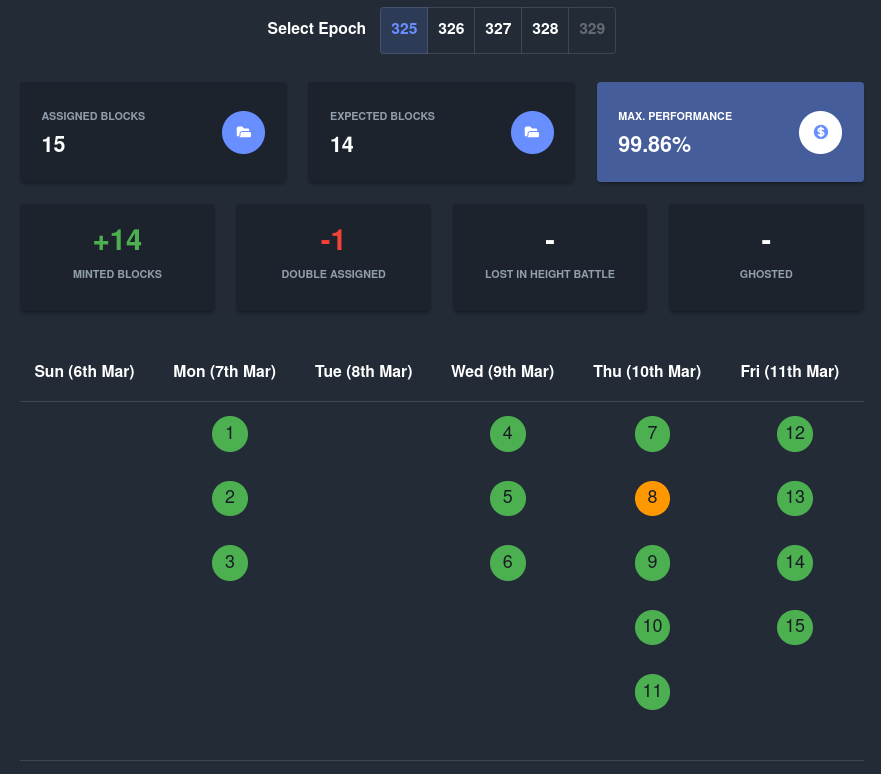

# Leaderlog API

A lightweight API to manage the leaderlog of a stake pool such that
it can be safely used by a Web application, i.e. the exact minting 
time of an assigned block isn't exposed in advance. At the moment,
this application makes use of the [Blockfrost API](https://blockfrost.io),
which is why an API key is needed for this service.

The [health dashboard](staking.outofbits.com/health) of SOBIT is powered by this API.



## Build

This application can easily be built with the following command. 

```bash
$ go mod vendor && go build
```

## Usage

```
Usage: leaderlog-api <pool-id> [options]
  -db-path string
        path to the directory with the leader log db. (default ".db")
  -hostname string
        location at which the API shall be served. (default "localhost")
  -level string
        level of logging. (default "info")
  -pool-id string
        pool ID in hex format.
  -port int
        port on which the API shall be served. (default 9001)
```

The application expects some values to be specified in your environment.

| Name                    | Usage                                             |
|-------------------------|---------------------------------------------------|
| BLU_BLOCKFROST_API_KEY  | Specifies the API key that shall be used for Blockfrost |
| BLU_AUTH_USERNAME | Specifies the username for access control |
| BLU_AUTH_PASSWORD | Specifies the password for access control |

## API Methods

### Post Leaderlog

This method allows to register the leaderlog for a certain epoch. The leaderlog
needs to be in the JSON format produced by the [cncli](https://github.com/AndrewWestberg/cncli)
tool. Posting the leaderlog is protected by a simple HTTP authentication
mechanism. The usernamecorresponds to `BLU_AUTH_USERNAME` and the password to
`BLU_AUTH_PASSWORD`.

```bash
$ curl --user username:password "http://localhost:9001/leaderlog"
```

### Get Registered Epochs

```bash
$ curl "http://localhost:9001/leaderlog/epoch?limit=${limit}"
```

The response looks as following.

```
[
    328,
    327,
    326,
    325,
    324
]
```

### Get Leaderlog

```bash
$ curl "http://localhost:9001/leaderlog/epoch/${epoch}/by/date?tz=${timezone}"
```

The response looks as following.

```
{
    "2022-03-17T00:00:00+01:00": [
        1,
        2
    ],
    "2022-03-18T00:00:00+01:00": [
        3,
        4,
        5,
        6
    ],
    "2022-03-19T00:00:00+01:00": [
        7,
        8
    ],
    "2022-03-20T00:00:00+01:00": [
        9,
        10
    ],
    "2022-03-21T00:00:00+01:00": [
        11
    ]
}
```

### Get Leaderlog Details of Minted Blocks

```bash
$ curl "http://localhost:9001/leaderlog/epoch/${epoch}/before/now"
```

Responses look like this. The status code has the following meaning:

* **1** ... **minted**, i.e. the assigned block has been minted properly by the
specified pool.
* **2** ... **double assigned**, i.e. another pool minted a block in the same
slot.
* **3** ... **height battle**, i.e. block has been lost in a height battler with
other pools.
* **4** ... **ghosted**, i.e. the exact reason for the lost block is unknown
(maybe producer was down).

```
[
    {
        "Epoch": 327,
        "No": 1,
        "EpochSlot": 24713,
        "Slot": 55925513,
        "Timestamp": "2022-03-17T05:36:44+01:00",
        "Status": 1,
        "RelevantBlock": {
            "ID": 76,
            "Epoch": 327,
            "EpochSlot": 55925513,
            "Slot": 24713,
            "Hash": "4e295605b6468bbf15510a62420f458280d4bbcca40a6950ed9bae040a5c3048",
            "Height": 7006475,
            "PoolID": "cdae4a1a08974113e77ea332cb1da97d9e3fca5cf797f9394739214b"
        }
    },
    ...
]
```
### Get Epoch Performance

```bash
$ curl "http://localhost:9001/leaderlog/epoch/${epoch}/performance"
```

Responses look like this.

```
{
    "assignedBlocks": 18,
    "epoch": 328,
    "expectedBlockNumber": 14.26,
    "maxPerformance": 1.2622720695013219,
    "status": {
        "doubleAssigned": 0,
        "ghosted": 0,
        "heightBattle": 0,
        "minted": 2,
        "notMinted": 16
    }
}
```

## Contact

* [Kevin Haller](kevin.haller@blockbllu.io) (Operator of the SOBIT stake pool)